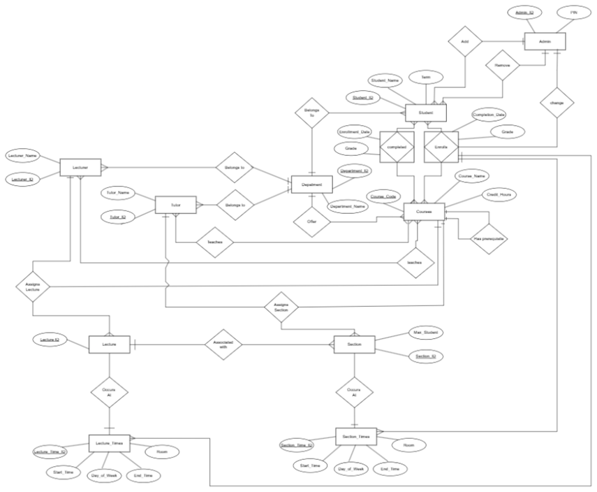
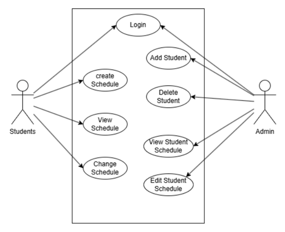

## 📚 University Course Scheduling & Enrollment System

A full web-based system for managing students, courses, prerequisites, lecturers, tutors, sections, lecture times, section times, enrollment, and completed courses.
Built using PHP, MySQL, HTML, CSS, JavaScript.

<div style="text-align: center;">
  
</div>


## ✨ Features
*🔐 Authentication*

    1. Students login using a PIN, which is securely hashed in the database. During login, the entered PIN is hashed and compared to the stored hash to verify the student’s identity.

    2. Admin login supported

    3. PHP session-based access control

*🎓 Student Features*

    View available courses

    View prerequisites

    Get recommended courses based on completed ones

    View enrolled courses

    Enroll in sections or lectures

    Drop courses

    View weekly schedule

    View completed courses + grades

***🧑‍🏫 Lecturer Features**

    View assigned lectures

    View course sections

    Access student enrollment lists

*👨‍🏫 Tutor Features*

    View assigned sections

    Manage attendance (optional feature)

*🧑‍💼 Admin Features*

    Add/delete students

    Assign lecturers to lectures

    Assign tutors to sections

    Create courses

    Add prerequisites

    Add course sections

    Add lecture time slots or section times

    Manage entire academic structure

*🗄️ Database Schema*

Below is the schema you provided, formatted clearly for documentation.

```
Department(Department_ID, Department_Name)

Course(Course_Code, Name, Credit_Hours, Department_ID)

Prerequisite(Course_Code, Prerequisite_Code)

Lecturer(Lecturer_ID, Name, Department_ID)

Tutor(Tutor_ID, Name, Department_ID)

Section(Section_ID, Max_Students)

Lecture(Lecture_ID, Section_ID)

SectionTime(SectionTime_ID, Section_ID, Day_of_Week, Start_Time, End_Time, Room)

LectureTime(LectureTime_ID, Lecture_ID, Day_of_Week, Start_Time, End_Time, Room)

LecturerCourse(Lecturer_ID, Course_Code, Course_Lecture_ID)

TutorCourse(Tutor_ID, Course_Code, Course_Section_ID)

Student(Student_ID, Name, PIN, Term, Department_ID)

CompletedCourses(Student_ID, Course_Code, Completion_Date, Grade)

Enrollment(Student_ID, Course_Code, Enrollment_Date, Grade,  
           LectureTime_ID, SectionTime_ID)

Admin(Admin_ID, PIN)
```

## 🧩 ERD (Entity Relationship Diagram)
<div style="text-align: center;">
  
</div>


## 🎭 simple Use Case Diagram ( with 2 main actors only)
<div style="text-align: center;">
  
</div>


## 🛠 Technologies

```
Tech	            Purpose
PHP	            Backend processing
MySQL	        Database
HTML / CSS	    UI
JavaScript	    Frontend logic
Sessions	    Authentication
```

## 🚀 How to Run

**1. Import the SQL schema**

Run the schema in MySQL:

```
CREATE DATABASE ScheduleDB;
USE ScheduleDB;
-- paste schema here
```
**2. Configure DB connection**

Modify:

Connect_DataBase.php

**3. Start server**

Using XAMPP/WAMP:

    http://localhost/project/Login.php

## some GUI Images
*Welcome page:*
<div style="text-align: center;">
  
</div>

*Student login page:*
<div style="text-align: center;">
  
</div>

*Admin Home page:*
<div style="text-align: center;">
  
</div>

*Admin Add Student page:*
<div style="text-align: center;">
  
</div>

*Admin Remove Student page:*
<div style="text-align: center;">
  
</div>

*Schedule page:*
<div style="text-align: center;">
  
</div>
